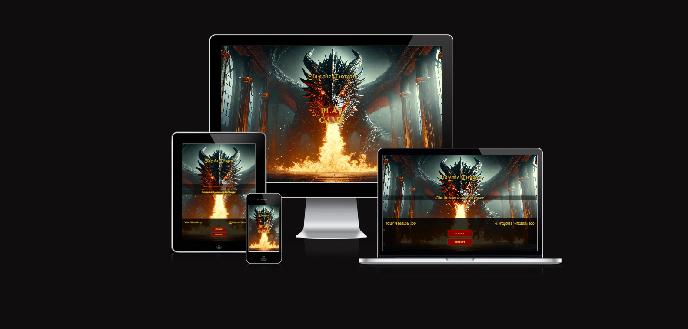
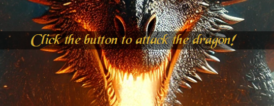
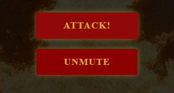
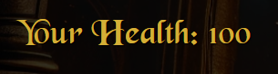
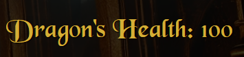
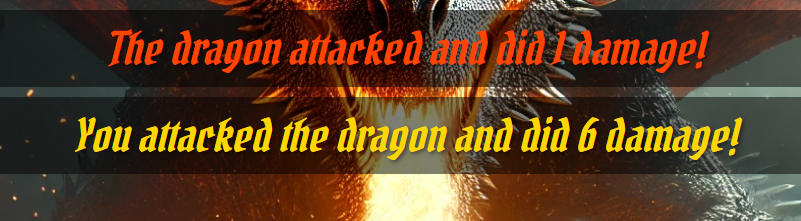
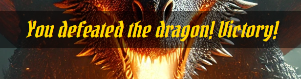
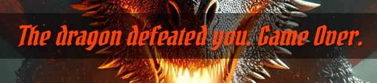
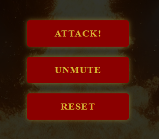
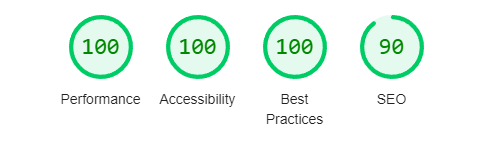

# Dragon Slayer

## Table of Contents
- [Overview](#overview)
- [Features](#features)
- [Existing Features](#existing-features)
- [Features Left to Implement](#features-left-to-implement)
- [Design](#design)
- [Bugs](#bugs)
- [Testing](#testing)
- [Validator Testing](#validator-testing)
- [Deployment](#deployment)
- [Credits](#credits)

## Overview
Dragon Slayer is a turn-based battle game between a player and a dragon. The player uses a dice to determine the damage dealt to the dragon, and the dragon retaliates in turn. The game ends when either the player or the dragon's health drops to zero.

## Features 

### Existing Features
- __Play Button__

  - Placed in the center of the opening page this feature will start the game, taking the user to the main game page and also starting the inititate the audio for the website.

- __Game Message__

  - On the main page the user is met with a text explaining how to start the game.
  
    

- __Buttons__

  - Both buttons are placed center/bottom of the screen for the user to interact with. The attack button initiates the dice roll and the mute button toggles the audio on and off.

    

- __Health__

  - Text showing the current users health which updates as the game progresses.

    

  - Text showing the current the dragons health which updates as the game progresses.

    

- __Game Message After Attack__

  - Once the user clicks the "Attack!" button. The game message shakes in the center of the page showing how much damage they did to the dragon. Within a short delay a follow up message shows above, stating how much damage the dragon did back"

    

- __End of Game__

  - If the user managed to win by getting the dragons health to zero before their health reaches zero they will be met with a victory message.

    

  - If the dragon beats the user they will be met with a defeat message.

    

- __Reset__

  - Once the game has finished, a reset button will appear at the bottom of the screen. If they wish to play again they can press this to reset back to default main menu to start again.

    

### Future Improvements

- **Ending Features**: Add audio/effect when victory or defeat appears.
- **Additional Features**: Include more interactive elements like special attacks, power-ups, and different dragons.

## Design

### User Experience

The user experience is designed to be smooth and engaging, with clear feedback mechanisms:

- **Health Indicators**: Both player and dragon health are prominently displayed and updated after each turn.
- **Attack Feedback**: The result of each attack is shown in the message area.
- **Background Music**: Adds to the immersive experience, with options to mute/unmute.

### Design Decisions

- **Font Choice**: 'BlackChancery' and 'Pirata One' were chosen to match the fantasy setting.
- **Color Scheme**: A dark background with golden text to provide a high contrast and fantasy-like feel.
- **Animations**: Subtle animations, like the shake effect on attack messages, enhance the feedback.

## Bugs
- **Audio**: Audio wouldnt autoplay, used play on click to get around this.
- **Media Files**: Pathing issue to live site for background image, font and favicon.
- **Smaller Screens**: Game Message would over lap with button on smaller screen, added media query.

## Testing 

| Test Case | Description | Steps | Expected Result | Actual Result | Status |
|-----------|-------------|-------|-----------------|---------------|--------|
| 1 | Initial game state | 1. Load the game   2. Check health values | Player and Dragon both have 100 health | Player and Dragon both have 100 health | Pass |
| 2 | Player attack | 1. Click "Attack" button   2. Observe player damage to dragon | Dragon health decreases by 1-10 | Dragon health decreases by correct amount | Pass |
| 3 | Dragon retaliates | 1. Click "Attack" button   2. Observe dragon damage to player | Player health decreases by 1-10 | Player health decreases by correct amount | Pass |
| 4 | Game reset | 1. Play the game until one health drops to 0   2. Click "Reset" button | Both Player and Dragon health reset to 100 | Both Player and Dragon health reset to 100 | Pass |
| 5 | Mute background music | 1. Click "Mute" button   2. Observe background music | Background music stops | Background music stops | Pass |
| 6 | Unmute background music | 1. Click "Mute" button again   2. Observe background music | Background music resumes | Background music resumes | Pass |
| 7 | Responsive design | 1. Resize the browser window   2. Observe layout | Layout adjusts to fit screen size | Layout adjusts correctly | Pass |

### Validator Testing 
- HTML
    - No errors were returned when passing through the official [W3C validator](https://validator.w3.org/nu/?doc=https%3A%2F%2Fcode-institute-org.github.io%2Flove-maths%2F)
- CSS
    - No errors were found when passing through the official [(Jigsaw) validator](https://jigsaw.w3.org/css-validator/validator)
- JavaScript
    - No errors were found when passing through the official [Jshint validator](https://jshint.com/)
      - The following metrics were returned: 
      - There are 14 functions in this file.
      - Function with the largest signature takes 1 arguments, while the median is 0.
      - Largest function has 19 statements in it, while the median is 4.5.
      - The most complex function has a cyclomatic complexity value of 3 while the median is 1.
- Lighthouse

    

## Deployment

- The site was deployed to GitHub pages. The steps to deploy are as follows: 
  - In the GitHub repository, navigate to the Settings tab 
  - From the source section drop-down menu, select the Master Branch
  - Once the master branch has been selected, the page will be automatically refreshed with a detailed ribbon display to indicate the successful deployment. 

The live link can be found here - https://niallpierce.github.io/Dragon-Slayer/

## Credits 

### Media
 
- **Font**: Font is called Black Chancery from [1001fonts](https://www.1001fonts.com/blackchancery-font.html)
- **Audio**: Audio is Battle of the Dragons from [Pixabay](https://pixabay.com/music/main-title-battle-of-the-dragons-8037/)
- **Background Image**: The image of the dragon was made using a discord image generator called [Midjourney](https://discord.com/invite/midjourney)
- **Sword Cursor**: The image for the sword cursor is from [cursors-4u](https://www.cursors-4u.com/cursor/2005/05/08/spo15-11.html)
- **Web Icon**: For the double swords in the browser i used [Favicon](https://favicon.io/)

### Support & Resources

- **W3schools**: Used to help with general syntax and parenting. Helped with Keyframe shake also.[KeyFrameShake](https://www.w3schools.com/howto/howto_css_shake_image.asp)
- **Stackoverflow**: Used to query play button and audio play on click.

