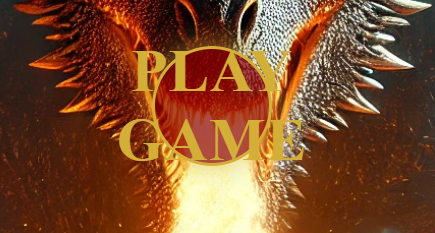

# Dragon Slayer

## Table of Contents
- [Overview](#overview)
- [Features](#features)
- [Existing Features](#existing-features)
- [Features Left to Implement](#features-left-to-implement)
- [Testing](#testing)
- [Validator Testing](#validator-testing)
- [Deployment](#deployment)
- [Credits](#credits)

## Overview
Dragon Fighter is a turn-based battle game between a player and a dragon. The player uses a dice to determine the damage dealt to the dragon, and the dragon retaliates in turn. The game ends when either the player or the dragon's health drops to zero.

## Features 

### Existing Features
- __Play Button__

  - Placed in the center of the opening page this feature will start the game, taking the user to the main game page and also starting the inititate the audio for the website.

### Features Left to Implement

## Testing 

### Validator Testing 

### Unfixed Bugs

## Deployment

## Credits 

### Content 

### Media

